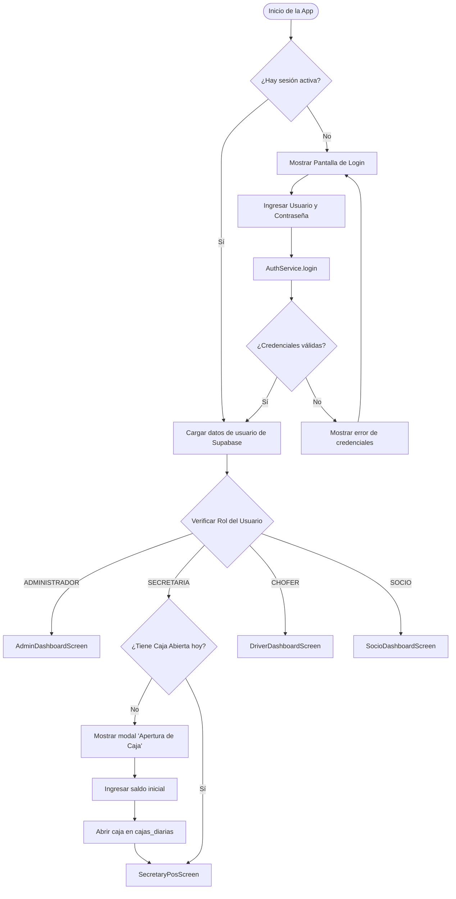
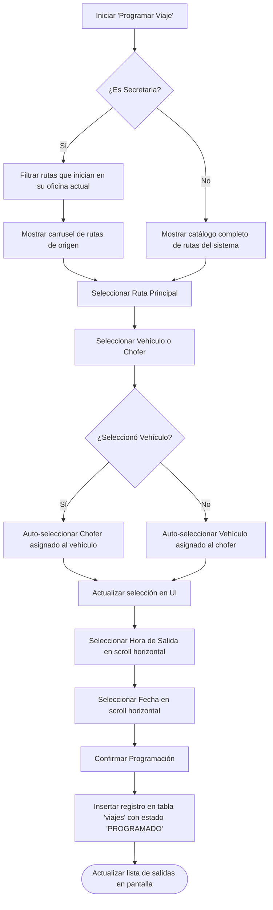
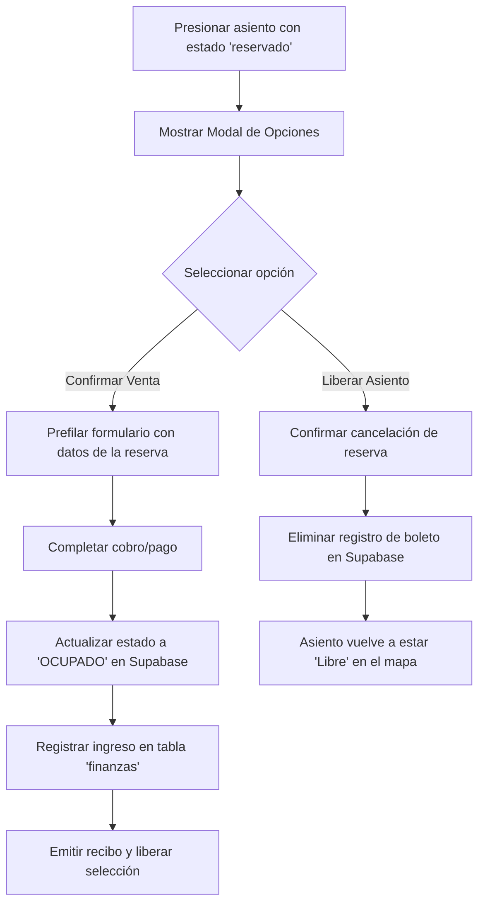
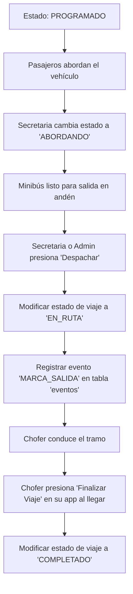
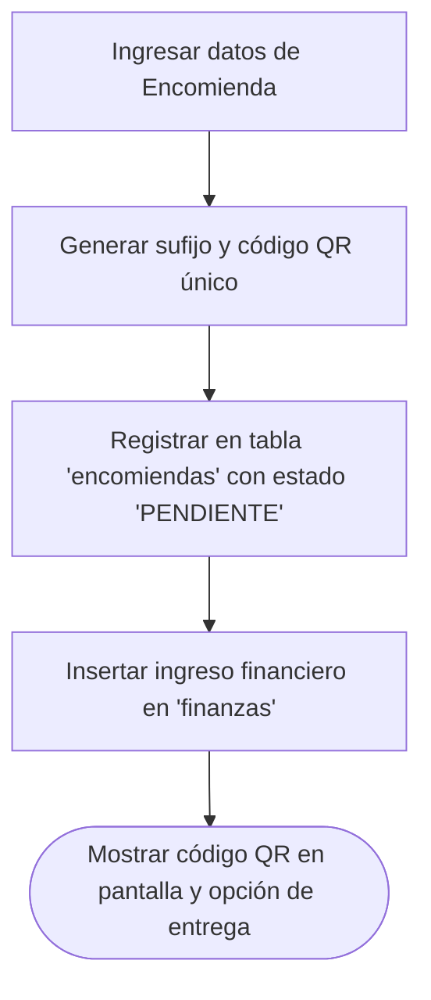
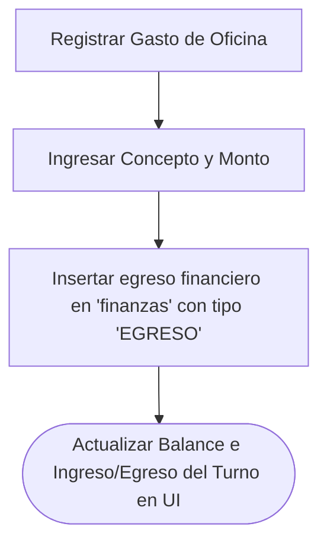

# 📊 Diagrama de Flujos del Sistema de Transporte

Este documento detalla los flujos lógicos y de operación de la aplicación móvil de transporte para conductores, socios, secretarias y administradores. Los diagramas se encuentran modelados utilizando la sintaxis de **Mermaid**, la cual se renderiza de forma visual directamente en editores compatibles con Markdown (como VS Code, GitHub o plataformas compatibles).

---

## 1. 🔑 Flujo de Autenticación y Redirección por Rol

Controla el inicio de sesión del usuario, la verificación de credenciales en Supabase, el desencriptado de contraseñas y la redirección a la interfaz correspondiente según su nivel de privilegios.



---

## 2. 📅 Flujo de Programación de Viajes (Despacho)

Muestra el flujo por el cual un Administrador o una Secretaria crea un nuevo viaje principal, incluyendo la validación del sentido de la ruta y la vinculación inteligente entre el Minibús (Vehículo) y el Conductor (Chofer).



---

## 3. 🎫 Flujo de Venta y Reserva de Pasajes

Describe la selección de asientos múltiples, la diferenciación entre pasajes regulares y convenios corporativos, y el registro de ventas u operaciones de reserva.

```mermaid
graph TD
  A[Seleccionar Asientos en el Mapa] --> B{¿Asiento(s) ocupado(s)?}
  B -- Sí --> C[Mostrar advertencia de ocupado]
  B -- No --> D{¿Asiento(s) reservado(s)?}
  D -- Sí --> E[Ir al Flujo de Gestión de Reservas]
  D -- No --> F[Agregar asiento a lista 'seleccionados']
  F --> G[Seleccionar Destino]
  G --> H[Cargar automáticamente el Costo entero según tarifario]
  H --> I{¿Es convenio corporativo?}
  I -- Sí --> J[Seleccionar Empresa del Convenio]
  I -- No --> K[Ingresar C.I. y Nombre del Pasajero]
  K --> L{¿Vender o Reservar?}
  L -- Vender --> M[Insertar Boleto con estado 'OCUPADO'] --> N[Registrar entrada financiera INGRESO en finanzas] --> O[Mostrar recibo digital y opción de compartir WhatsApp]
  L -- Reservar --> P[Insertar Boleto con estado 'RESERVADO'] --> Q[Actualizar mapa de asientos a color Amarillo]
```

---

## 4. 🔄 Flujo de Gestión y Confirmación de Reservas

Describe cómo interactúa la secretaria al presionar un asiento reservado (en color amarillo/oro) para confirmar su venta final o liberar la plaza.



---

## 5. 🟢 Flujo del Control de Despacho (Tablero Kanban)

Detalla la transición de los estados de un viaje programado por las terminales desde su inicio hasta su arribo final.



---

## 6. 📦 Flujo de Registro de Encomiendas y Caja

Muestra las transacciones complementarias de la oficina: el registro de paquetes (generando su correspondiente código QR) y la declaración de egresos financieros cotidianos.

### Registro de Encomiendas


### Control de Caja y Gastos Diarios

